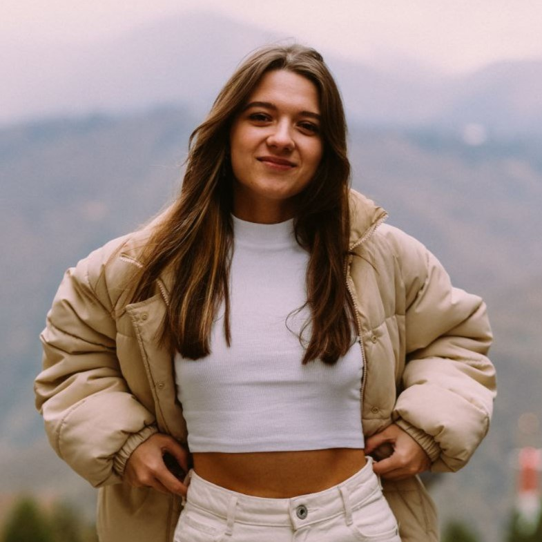

# Personal information

**Name:** Bobrina Daria aka Sheeshda\
**Location:** Russia, Saint-Petersburg\
**Contact information:** 
+ Email: *Dashulikava@mail.ru*
+ Discord: *shida_sheeshda*
+ GitHub: [Sheeshda](https://github.com/Sheeshda)
+ Telegramm: *@Shidarius*
+ VK: [Bobrina Dasha](https://vk.com/id33829002) 


## About me:

For a long time, I have been working on my own, following the principle of "work for the sake of work". However, it was time to change that. After reviewing numerous job openings, looking for a position that would not only be interesting but also align with my skills,  the choice was made in favor of Front-end developer.

At the moment, there is a huge motivation to absorb all the knowledge and skills in order to put them into practice with confidence and develop further.

## Skills:
+ Programming languages: HTML, CSS, JavaScript (all on basic level);
+ Programming tools: VS Code, Git;
+ Graphic editors: Figma, Photoshop, Adobe Lightroom;
+ 3D programs: Autocad, 3D Max, Blender, SolidWorks, Kompas3D

## Example code:
```
</head>
<body>
    <section class="container">
    <h1 class="title">Title"</h1>
    
    <div class="text-wrapper">
```

## Education & courses:
+ [x] St. Petersburg State University of Railways of Emperor Alexander I; The direction of training: Trading business;
+ [x] Knower School - Inviz Interior Course;
+ [ ] RSSchool - JavaScript/Front-end 2025Q3

## Languages:

+ Russian - Native speaker;
+ English - B2 (Upper Intermediate), [EF SET English Test Results](https://cert.efset.org/en/uwqX2S);
+ Spanish - A1 (Beginner)


### new for checking commit